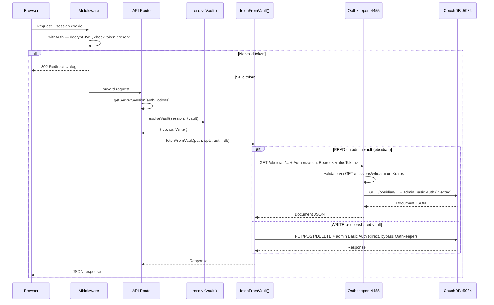
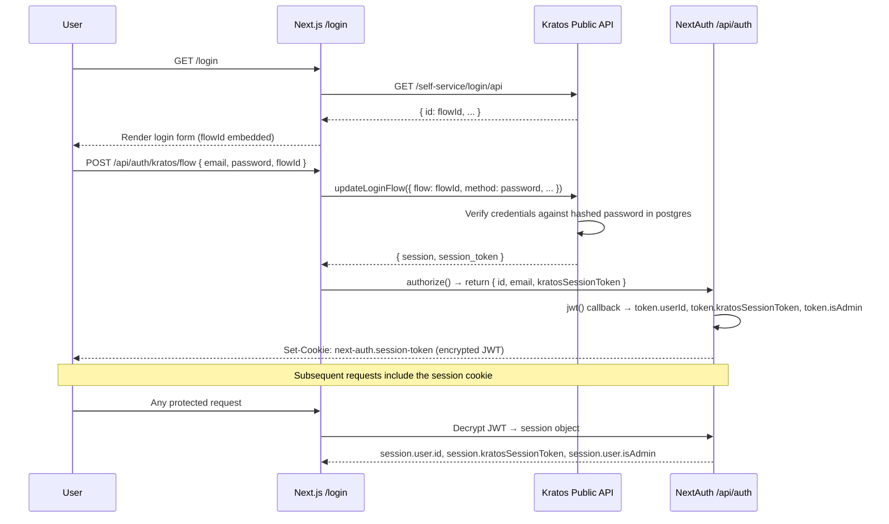
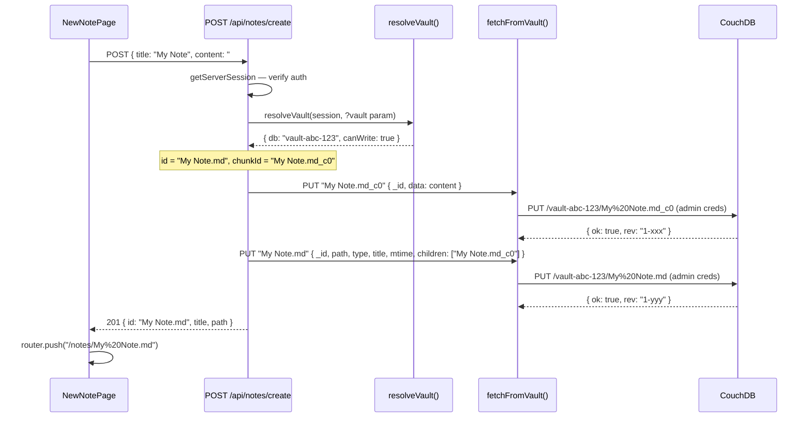
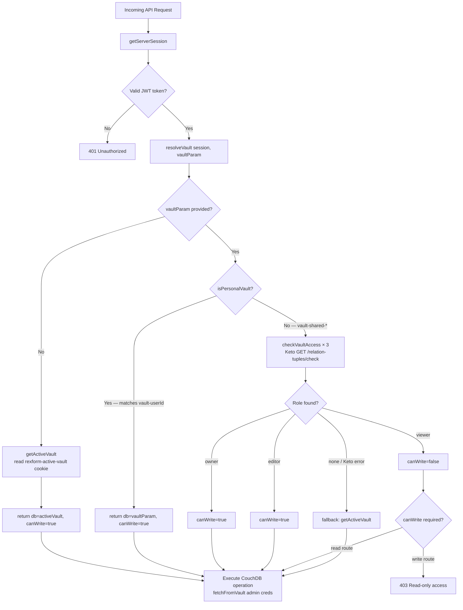

# Architecture

## Request Flow

Full lifecycle from browser to CouchDB for a note API call.



---

## Authentication Flow

Login and registration lifecycle.



---

## Vault Isolation

How different users are routed to different CouchDB databases.

```mermaid
flowchart TD
    UA[User A\nid: abc-123] -->|getUserVaultName| VA[(vault-abc-123)]
    UB[User B\nid: def-456] -->|getUserVaultName| VB[(vault-def-456)]
    ADM[Admin User\nADMIN_USER_ID match] -->|getAdminVaultName| VO[(obsidian)]
    UC[User C] -->|Keto: owner| VS[(vault-shared-xyz789)]
    UD[User D] -->|Keto: editor| VS
    UE[User E] -->|Keto: viewer\ncanWrite=false| VS

    VA -->|_security.members=[abc-123]| CDB[(CouchDB)]
    VB -->|_security.members=[def-456]| CDB
    VO -->|_security.admins=[admin]| CDB
    VS -->|_security.members=[userC,userD,userE]| CDB
```

---

## Note Creation Flow

What happens when a user creates a new note.



---

## Permission Check Flow

How Keto permissions are evaluated for shared vault access.



---

## Data Flows

### Registration

```
User registers
  → Kratos creates identity in kratos-postgres
  → Kratos fires webhook → rexform-notes /api/hooks/kratos/after-register
      → createUserVault(userId)
          → CouchDB: PUT /vault-<userId>           create DB
          → CouchDB: PUT /vault-<userId>/_security  lock to admin only
          → CouchDB: seed 3 starter notes
          → CouchDB: PUT /_users/org.couchdb.user:<userId>  LiveSync credentials
          → CouchDB: configure CORS (idempotent)
```

### Login & Note Access

```
User logs in
  → NextAuth ← Kratos credentials flow
  → kratosSessionToken stored in encrypted JWT cookie

User opens notes
  → GET /api/notes?page=1&limit=20
      → resolveVault(session)  reads rexform-active-vault cookie
      → fetchFromVault(_all_docs, admin creds, vault-<userId>)
      → filter to .md files only (isVaultNote), sort by mtime, paginate
```

### Shared Vault Access

```
Admin creates shared vault
  → POST /api/admin/vaults
      → createSharedVault(name, creatorId) in CouchDB
      → grantVaultAccess(vaultId, creatorId, 'owner') in Keto
      → syncVaultSecurity(vaultId) → CouchDB _security.members.names updated

Admin adds member
  → POST /api/admin/vaults/[vaultId]/members
      → revoke existing role (if any) in Keto
      → grant new role in Keto
      → syncVaultSecurity(vaultId) → CouchDB _security updated

Member accesses shared vault
  → resolveVault(session, 'vault-shared-xxx')
      → checkVaultAccess(vaultId, userId, role) via Keto Read API
      → returns { db: 'vault-shared-xxx', canWrite: true/false }
  → fetchFromVault(path, admin creds, vault-shared-xxx)
```

### Obsidian LiveSync

```
User opens Settings → copies Server URL, Database, Username, Password
  (these are the CouchDB _users credentials, not the admin password)

Obsidian LiveSync plugin connects:
  → HTTPS → couch-db-production.up.railway.app
  → Authenticates as userId (not admin)
  → CouchDB _security.members.names allows this user into vault-<userId>
  → Bidirectional sync: local vault ↔ CouchDB vault-<userId>
```

---

## Key Architectural Decisions

| Decision | Reason |
|---|---|
| Writes bypass Oathkeeper | Kratos session tokens expire; stale tokens cause silent 401s on saves |
| Public CouchDB URL for admin ops | Railway internal hostname silently drops Basic auth headers |
| Keto Read API (port 4466) for member lists | Write API (port 4467) returns empty results for list queries |
| `echo y \| keto migrate up` in Dockerfile | Keto v0.11 has no `--yes` flag; prompts interactively otherwise |
| `syncVaultSecurity()` on every Keto change | LiveSync needs `_security.members.names` in sync with Keto tuples |
| Admin credentials for all server-side CouchDB calls | Consistent, never expire; auth already enforced at Next.js API layer |
